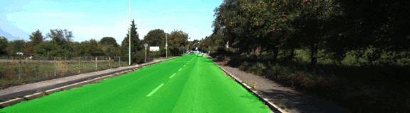
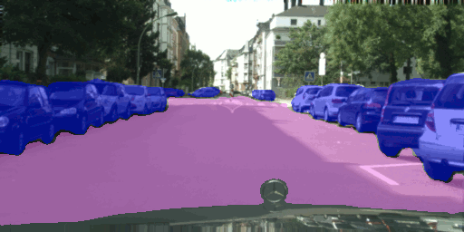
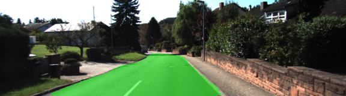
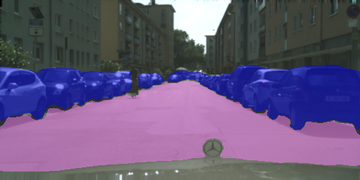
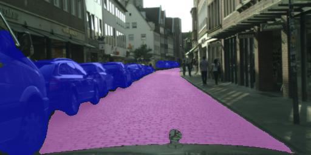
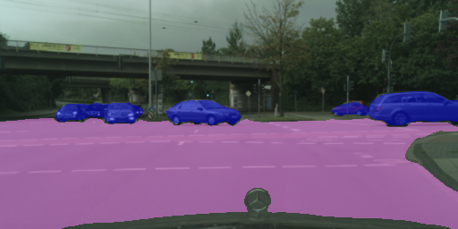

# Semantic Segmentation

### Udacity Self-Driving Car Engineer Nanodegree. Project: Vehicle Detection and Tracking

This Project is the twelfth task of the Udacity Self-Driving Car Nanodegree program. The main goal of the project is to train an artificial neural network for semantic segmentation of a video from a front-facing camera on a car in order to mark road pixels using Tensorflow.

## Results

KITTI Road segmentation (main task of the project):



Cityscapes multiclass segmentation (optional task):



## Content of this repo

- `Segmentation.ipynb` - Jupyter notebook with the main code for the project
- `helper.py` - python program for images pre- and  post- processing.
- `runs` - directory with processed images
- `cityscapes.ipynb` - Jupyter notebook with some visualization and preprocessing of the Cityscape dataset. Please, see the notebook for correct dataset directories placing. 
- `Segmentation_cityscapes.ipynb` - Jupyter notebook with the main code for the Cityscape dataset.
- `helper_cityscapes.py` - python program for images pre- and  post- processing for the Cityscape dataset.

**Note:** The repository does not contain any training images. You have to download the image datasetsplace them in appropriate directories on your own.

### Architecture

A Fully Convolutional Network (FCN-8 Architecture developed at Berkeley, see [paper](https://people.eecs.berkeley.edu/~jonlong/long_shelhamer_fcn.pdf) ) was applied for the project. It uses VGG16 pretrained on ImageNet as an encoder.
Decoder is used to upsample features, extracted by the VGG16 model, to the original image size. The decoder is based on transposed convolution layers.

The goal is to assign each pixel of the input image to the appropriate class (road, backgroung, etc). So, it is a classification problem, that is why, cross entropy loss was applied.

### Setup

Hyperparameters were chosen by the try-and-error process. Adam optimizer was used as a well-established optimizer. Weights were initialized by a random normal initializer. Some benefits of L2 weights regularization were observed, therefore, it was applied in order to reduce grainy edges of masks.

### Augmentation

Resized input images were also treated by random contrast and brightness augmentation (as linear function of the input image). It helps to produce reasonable predictions in difficult light conditions.

```Python
def bc_img(img, s = 1.0, m = 0.0):
    img = img.astype(np.int)
    img = img * s + m
    img[img > 255] = 255
    img[img < 0] = 0
    img = img.astype(np.uint8)
    return img   
```




_Deep shadows and contrast variations are not a problem because of rich augmentation on the training stage._

## Cityscapes

Two classes (roads and cars) were chosen from the Cityscapes dataset for the optional task. The classes are unbalanced (roads are prevalent), so, a weighted loss function was involved (see [Segmentation_cityscapes.ipynb](Segmentation_cityscapes.ipynb
) for details). Interestingly, RMSProp optimizer performed better for the imageset.

Unfortunately, accord to the Cityscapes dataset licence I can not publish all produced images, however, there are some of them.



_It correctly do not label a cyclist as a car, but mark small partly occluded cars._



_It does not have problems with recognizing a cobbled street as a road._



_And the ANN is able to mark cars in different projections._

References:

1. [KITTI](http://www.cvlibs.net/datasets/kitti/) dataset
2. [Cityscapes](https://www.cityscapes-dataset.com/) dataset
3. [FCN](https://people.eecs.berkeley.edu/~jonlong/long_shelhamer_fcn.pdf) ANN

_____________________ Udacity Readme.md ____________________


### Setup
##### Frameworks and Packages
Make sure you have the following is installed:
 - [Python 3](https://www.python.org/)
 - [TensorFlow](https://www.tensorflow.org/)
 - [NumPy](http://www.numpy.org/)
 - [SciPy](https://www.scipy.org/)
##### Dataset
Download the [Kitti Road dataset](http://www.cvlibs.net/datasets/kitti/eval_road.php) from [here](http://www.cvlibs.net/download.php?file=data_road.zip).  Extract the dataset in the `data` folder.  This will create the folder `data_road` with all the training a test images.

### Start
##### Implement
Implement the code in the `main.py` module indicated by the "TODO" comments.
The comments indicated with "OPTIONAL" tag are not required to complete.
##### Run
Run the following command to run the project:
```
python main.py
```
**Note** If running this in Jupyter Notebook system messages, such as those regarding test status, may appear in the terminal rather than the notebook.

### Submission
1. Ensure you've passed all the unit tests.
2. Ensure you pass all points on [the rubric](https://review.udacity.com/#!/rubrics/989/view).
3. Submit the following in a zip file.
 - `helper.py`
 - `main.py`
 - `project_tests.py`
 - Newest inference images from `runs` folder
 
 ## How to write a README
A well written README file can enhance your project and portfolio.  Develop your abilities to create professional README files by completing [this free course](https://www.udacity.com/course/writing-readmes--ud777).
